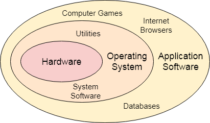

[/index](./)

## tutorial guide

1. [setup an environment](/bios/intro.md)
2. [boot sector](/bios/bootsec.md)
3. [printing on screen](/bios/printsec.md)
4. [code loops, functions](/bios/codesec.md)
5. [address memory in 16-bit real mode segmentation](/bios/addressec.md)
6. [read data from disk](/bios/readsec.md)
7. [define the GDT](/bios/gdt.md)
8. [enter 32-bit protected mode](/bios/pm.md)
9. [Create a development environment to build your kernel](/bios/env.md)
10. [create a simple kernel and a bootsector to load it](/bios/kernel.md)
11. [use VGA card data ports](/bios/vga.md)
12. [setup the IDT to handle CPU interrupts](/bios/idt.md)
13. [IRQ handlers, timer & keyboard](/bios/irq.md)
14. [parse user input - tiny shell](/bios/shell.md)
15. [memory allocator](/bios/alloc.md)

## some theory

A kernel can be defined as an interface between user and hardware. It is responsible for the execution of all the processes, Resource Allocation, CPU management, File Management and many other tasks.

The purpose of an operating system is to provide an environment in which a user can execute programs in convenient and efficient manner.

Structure of a Computer System

A Computer System consists of:

- Users (people who are using the computer)
- Application Programs (Compilers, Databases, Games, Video player, Browsers, etc.)
- System Programs (Shells, Editors, Compilers, etc.)
- Kernel ( A special program which acts as an interface between user and hardware )
- Hardware ( CPU, Disks, Memory, etc)