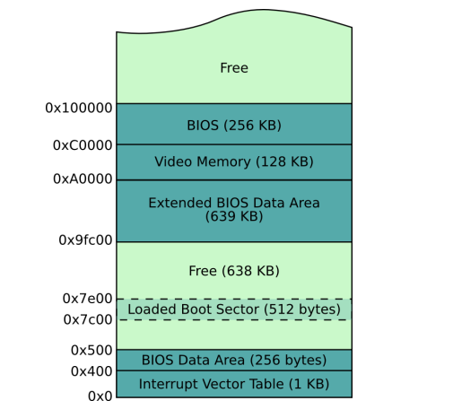

[/index](./)

#### Learn how the computer memory is organized

Look at the figure below, it displays the typical memory layout after boot.



The BIOS stores the boot sector at `0x7C00` 

We want to print an X on screen. We will try 2 different strategies
and see which ones work and why.

**Open the file `boot_sect_memory.asm`**

First, we will define the X as data, with a label:
```nasm
the_secret:
    db "X"
```

Then we will try to access `the_secret` in many different ways:

1. `mov al, the_secret`
2. `mov al, [the_secret]`
3. `mov al, the_secret + 0x7C00`
4. `mov al, 2d + 0x7C00`, where `2d` is the actual position of the 'X' byte in the binary


If you compile and run the code you'll see a string similar to `1[2¢3X4X`, where
the bytes following 1 and 2 are just random garbage.

If you add or remove instructions, remember to compute the new offset of the X
by counting the bytes, and replace `0x2d` with the new one.

The global offset
-----------------

Now, since offsetting `0x7c00` everywhere is very inconvenient, assemblers let
us define a "global offset" for every memory location, with the `org` command:

```nasm
[org 0x7c00]
mov ah, 0x0e

mov al, "1"
int 0x10
mov al, [the_secret]
int 0x10

jmp $ ; infinite loop

the_secret:
    ; ASCII code 0x58 ('X') is stored just before the zero-padding.
    ; On this code that is at byte 0x2d (check it out using 'xxd file.bin')
    db "X"

; zero padding and magic bios number
times 510-($-$$) db 0
dw 0xaa55
```
-----

#### Learn how to address memory with 16-bit real mode segmentation


We did segmentation with `[org]`. Segmentation means that you can specify an offset to all the data you refer to.

This is done by using special registers: `cs`, `ds`, `ss` and `es`, for Code, Data, Stack and Extra (i.e. user-defined)

Beware: they are *implicitly* used by the CPU, so once you set some value for, say, `ds`, then all your memory access will be offset by `ds`.

Furthermore, to compute the real address we don't just join the two addresses, but we *overlap* them: `segment << 4 + address`. For example, if `ds` is `0x4d`, then `[0x20]` actually refers to `0x4d0 + 0x20 = 0x4f0`

Hint: We cannot `mov` literals to those registers, we have to
use a general purpose register before.


-----
#### Learn how to use the stack

Remember that the `bp` register stores the base address (i.e. bottom) of the stack,
and `sp` stores the top, and that the stack grows downwards from `bp` (i.e. `sp` gets
decremented)

Read the code below, is self explainatory and try to test it on your own.

```nasm
mov ah, 0x0e ; tty mode

mov bp, 0x8000 ; this is an address far away from 0x7c00 so that we don't get overwritten
mov sp, bp ; if the stack is empty then sp points to bp

push 'A'
push 'B'
push 'C'

; to show how the stack grows downwards
mov al, [0x7ffe] ; 0x8000 - 2
int 0x10

; however, don't try to access [0x8000] now, because it won't work
; you can only access the stack top so, at this point, only 0x7ffe (look above)
mov al, [0x8000]
int 0x10


; recover our characters using the standard procedure: 'pop'
; We can only pop full words so we need an auxiliary register to manipulate
; the lower byte
pop bx
mov al, bl
int 0x10 ; prints C

pop bx
mov al, bl
int 0x10 ; prints B

pop bx
mov al, bl
int 0x10 ; prints A

; data that has been pop'd from the stack is garbage now
mov al, [0x8000]
int 0x10


jmp $
times 510-($-$$) db 0
dw 0xaa55
```
