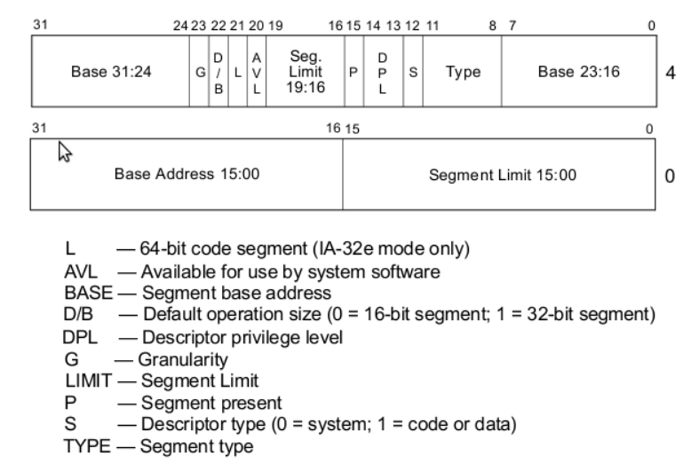

[/index](../bios.md)

program the GDT

In 32-bit mode, segmentation works differently. Now, the offset becomes an
index to a segment descriptor (SD) in the GDT. This descriptor defines
the base address (32 bits), the size (20 bits) and some flags, like
readonly, permissions, etc. 



The easiest way to program the GDT is to define two segments, one for code
and another for data. These can overlap which means there is no memory protection,
but it's good enough to boot.

As a curiosity, the first GDT entry must be `0x00` to make sure that the
programmer didn't make any mistakes managing addresses.

Furthermore, the CPU can't directly load the GDT address, but it requires
a meta structure called the "GDT descriptor" with the size (16b) and address
(32b) of our actual GDT. It is loaded with the `lgdt` operation.

-----
Code

```nasm
gdt_start: ; don't remove the labels, they're needed to compute sizes and jumps
    ; the GDT starts with a null 8-byte
    dd 0x0 ; 4 byte
    dd 0x0 ; 4 byte

; GDT for code segment. base = 0x00000000, length = 0xfffff

gdt_code: 
    dw 0xffff    ; segment length, bits 0-15
    dw 0x0       ; segment base, bits 0-15
    db 0x0       ; segment base, bits 16-23
    db 10011010b ; flags (8 bits)
    db 11001111b ; flags (4 bits) + segment length, bits 16-19
    db 0x0       ; segment base, bits 24-31

; GDT for data segment. base and length identical to code segment

gdt_data:
    dw 0xffff
    dw 0x0
    db 0x0
    db 10010010b
    db 11001111b
    db 0x0

gdt_end:

; GDT descriptor
gdt_descriptor:
    dw gdt_end - gdt_start - 1 ; size (16 bit), always one less of its true size
    dd gdt_start ; address (32 bit)

; define some constants for later use
CODE_SEG equ gdt_code - gdt_start
DATA_SEG equ gdt_data - gdt_start
```
